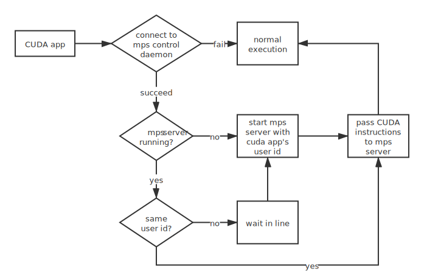

## Overview
MPS stands for multi-process service. It enables multiple cuda contexts to run concurrently on the same GPU. See [NVDIA MPS](https://docs.nvidia.com/deploy/mps/index.html) for more info.

Note:
1. Only available on post-Kepler GPUs, i.e. SM 3.5 or later
2. Only available on Linux system (as of April 2022)
3. The MPS control daemon is bound to a specific GPU device so if you have multiple GPUs, you will have to start multiple control daemons
4. There is an upper limit on how many clients an MPS server can support, for SM 3.5 to SM 6.0, the number is 16. For SM 7.0 it is 48 clients.

## How does MPS work?
Nvidia MPS is a client/server architecture. When MPS is enabled, all CUDA applications work as clients to the MPS server. Instead of sending instructions to the GPU directly, apps send them via the MPS server. In essence, the MPS server acts as a scheduler. It assigns time slices on the GPU to each CUDA application. It is recommended to enable Nvidia exclusive mode on GPU to make the most out of MPS.

One thing to watch out for is that each MPS server is associated with a uid. Only CUDA apps with the same uid can access the MPS server. This rule exists to prevent different user's programs from interfering with each other. In the case of an existing MPS server, CUDA apps with a different uid will be queued and have to wait. Once the old MPS server exits, the MPS control daemon will wake up the first sleeping CUDA app and start an MPS server with the app's uid. Don't worry, these all happen automatically.



## The history of MPS
> If you are not interested in how the MPS evolves, feel free to skip to the next section.

- **Before Kepler**
The GPU is working as an embedding single-chip microprocessor. There can be at most one context doing work, which most of the time underutilizes the GPU.

- **Since Kepler**
With MPS running, multiple contexts can share a GPU. The MPS runtime architecture is designed to enable co-operative multi-processing between CUDA applications. In that sense, MPS is working much like a scheduler (e.g. CFS) in a Linux system.

- **Since Volta**
Nvidia introduces new MPS capabilities in the Volta architecture:
 1. Volta MPS clients can submit work directly to GPU without passing through the MPS server.
 2. Each Volta MPS client owns its own GPU memory address space instead of sharing the whole address space with other clients.
 3. Supports quality-of-services (QoS) for different clients.

## Working with MPS
Working with MPS is easy. You simply start up an MPS control daemon and instruct your CUDA apps to talk with the control daemon. No extra code is needed!

### Start mps control daemon
```bash
git clone git@github.com:nnlib/nvidia_mps_helper.git
# start MPS on gpu #3
sudo env GPU_ID=3 bash start_mps.bash
```

### Run your CUDA application
```bash
export GPU_ID=3
export CUDA_MPS_PIPE_DIRECTORY=/tmp/mps_$GPU_ID
# here is a testing script I wrote
## show num of available devices
python cuda_app.py
## do some work on device 0
python cuda_app.py --gpu 0
```

Note that via MPS, the CUDA application would see only one GPU. Try to run `python cuda_app.py --gpu 3` in the above snippet and see what happens.
Here is the output I got:
```
num of available GPUs: 1
Traceback (most recent call last):
 File "cuda_app.py", line 13, in <module>
 device = cuda.Device(gpu_id)
pycuda._driver.LogicError: cuDeviceGet failed: invalid device ordinal
```

As you can see, `pycuda` complains about the trouble finding GPU #3 because the total number of available GPUs is 1.


### Stop mps control daemon
```bash
sudo env GPU_ID=3 bash stop_mps.bash
```

### Pass command to mps control daemon
```bash
env GPU_ID=3 bash cmd_mps.bash <command>
```
see `man 1 nvidia-cuda-mps-control` for a list of available commands
